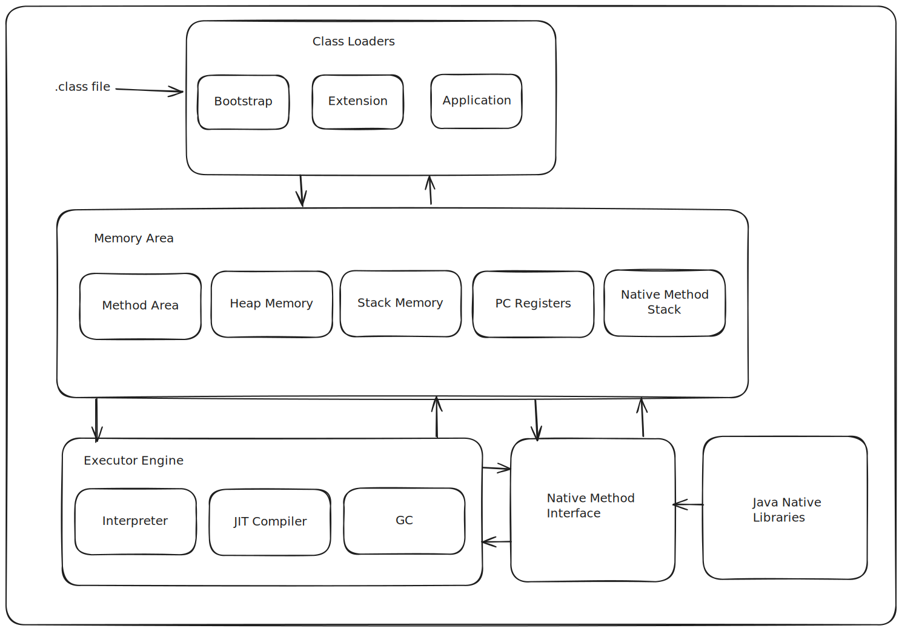

# JVM Architecture

# Classloader 

It's responsibile for loading, linking and initialization

## Loading

- Load .class files
- Converts them to binary
- Save to method area

## Linking

Responsible for creating 3 tasks

- Verification
- Preparation
- Resolution

### Verification
Ensure the correctness of .class files
Check for format
Throws java.lang.Verify Error if verification fails

### Preparation
Allocates memory for static membersS
Initialize memory to default values

### Resolution
Transform symbolic references into direct references

## Initialization

- Static variables are assigned with values
- Executed from top to bottom

## Types of Classloaders

- Bootstrap Classloaders
- Extension Classloaders
- System/Application Classloaders

### Bootstrap Class Loader

- Load classes from bootstrap path $JAVA_HOME/jre/lib

### Extension Class Loader

- Child of bootstrap class loader
- Load classes from $JAVA_HOME/jre/lib/ext

### System/Application Class Loader

- Child of the extension class loader
- Load classes from the application classpath
- Environment Variable which mapped to java.class.path

In the delegation-hierarchy the Bootstrap Class Loader will try to find the class, if it didn't find, it will delegate to Extension Class Loader, if it didn't find, it will delegate to System/Application Class Loader

# JVM Memory 

## Method Area
- Class Level information is stored (ClassName, Parent Name, Methods, Variable Information)
- Only 1 method area per JVM
- Shared resource

## Heap Area
- Information of all object is stored
- One heap per JVM
- Shared resource

## Stack Memory
- One runtime stack for ever thread is store here
- Every block of stack (activation record / stack frame) stores method calls
- Runtime stack will be destroyed after thread is terminated
- Not a shared resource

## PC Registers
- Stores address of current execution instruction of thread
- Each thread have separate PC Registers

## Native Method Stacks
- Stores native method information
- Separate native stack for every thread

# Execution Engine
- Execution engine is the one who executes the bytecode
- Classified in 3 parts (Interpreter, Just In Time Compiler, Gargage Collector)

## Interpreter
- Interprets byte code line by line and executess
- Disavantage - If a method is called multiple times, it will be interpreted multiple times

## JIT Compiler
- Increases efficiency of interpreter
- JIT provides direct native code to avoid reinterpretation